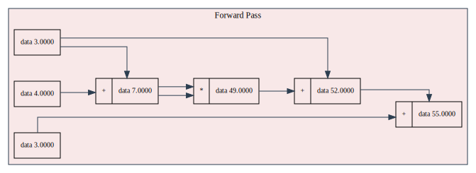
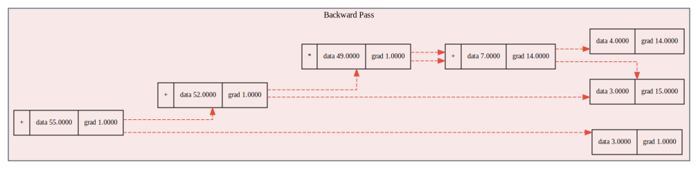
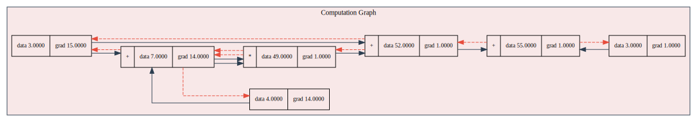

<div align="center">

<picture>
  <source media="(prefers-color-scheme: dark)" srcset="./assets/logo_dark.png">
  
</picture>

</div>

# GigaGrad

**GigaGrad** is a minimal automatic differentiation (autograd) engine and neural network framework written in pure **C**. 
It is being developed to explore the **viability of implementing autograd** in C. It serves as a testbed for low-level automatic differentiation, and may evolve into or influence future iterations of [C-ML](https://github.com/jaywyawhare/c-ml). 
> ⚡ _Giga performance, micro simplicity — in C._

## Examples

### 1. Basic Autograd Example

```bash
$ ./bin/gigagrad
Forward Pass Results:
a = 3.0000
b = 4.0000
c = (a + b) = 7.0000
d = (c * c) = 49.0000
e = (d + a) = 52.0000
f = (e + 3) = 55.0000

Backward Pass Results (Gradients):
∂f/∂a = 15.0000
∂f/∂b = 14.0000
∂f/∂c = 14.0000
∂f/∂d = 1.0000
∂f/∂e = 1.0000
∂f/∂f = 1.0000
```

### 2. Neural Network Example (Marathi Digit Recognition)

```bash
$ ./bin/digit
Split dataset: 4000 training samples, 2000 test samples

Training Progress:
Epoch 1  | Train Loss: 2.2969 | Train Accuracy: 12.97%
Epoch 5  | Train Loss: 2.2810 | Train Accuracy: 38.20%
Epoch 10 | Train Loss: 2.1864 | Train Accuracy: 99.88%

Final Test Results:
Evaluation: Loss: 2.1653 | Accuracy: 100.00%
```

### 3. Computation Graph Visualization

GigaGrad can generate computation graphs in DOT format that can be visualized using Graphviz:

```bash
# Generate SVG files from DOT files
$ for file in output/*.dot; do dot -Tsvg "$file" -o "${file%.dot}.svg"; done
```

<div align="center" style="margin: 40px 0;">
  
  <h3>Forward Computation Graph</h3>
  <br><br>

  <h3>Backward Computation Graph</h3>
  <br><br>

  <h3>Full Computation Graph</h3>
  

</div>

## Roadmap

- [x] Scalar Value type with gradient tracking
- [x] Support for basic ops: +, *, -, /, **, ReLU
- [x] Reverse-mode autodiff (backward pass)
- [x] Computation graph (DAG traversal)
- [x] Minimal test example - Marathi digit recognition

## Installation

To install and build GigaGrad locally:

### 1. Clone the Repository

```bash
git clone git@github.com:jaywyawhare/GigaGrad.git
```

### 2. Install Dependencies
GigaGrad requires a C compiler and `make` to build. `graphviz` is optional for visualizing the computation graph.

```bash
sudo apt-get install build-essential graphviz make gcc
```

### 3. Install the dataset
Any dataset can be used, but the example uses the Marathi digit recognition dataset.
```bash
python3 get_data.py
```
This will download the dataset and save it in the `.cache` directory. Only copy the Numbers folder to the base directory. Reshape the images to 28x28 and convert them to grayscale.    

### 4. Build the Project

```bash
cd GigaGrad
make 
```

### 5. Run the Example

```bash
./bin/digit
```

This will execute the minimal example binary once compiled.

## Inspiration

- [micrograd](https://github.com/karpathy/micrograd) — scalar autograd engine in Python
- [tinygrad](https://github.com/geohot/tinygrad) — minimalist DL framework with GPU support